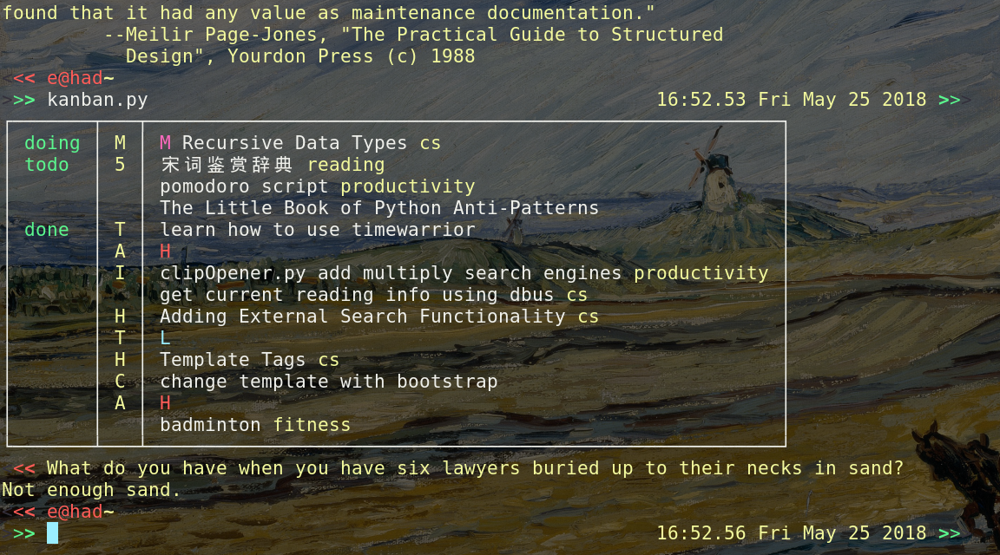

# taskwarrior-terminal-kanban
A simple terminal kanban for taskwarrior

This script is forked from [vim taskwarrior Kanban board](https://github.com/j-jith/vim-taskwarrior-kanban). Instead of running within vim, this script runs in a terminal. I also just added some functionality like color pprint.




This script depends on `terminaltables` and `colorama`. You should be able to get them by

```
pip install -r requirements.txt
```

## To Do

- [ ] Fix terminal color code mingling with string length.

